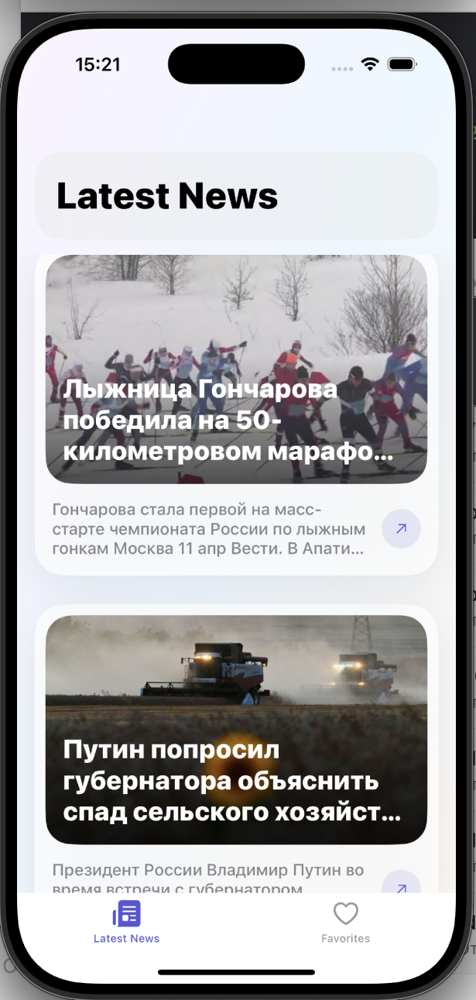
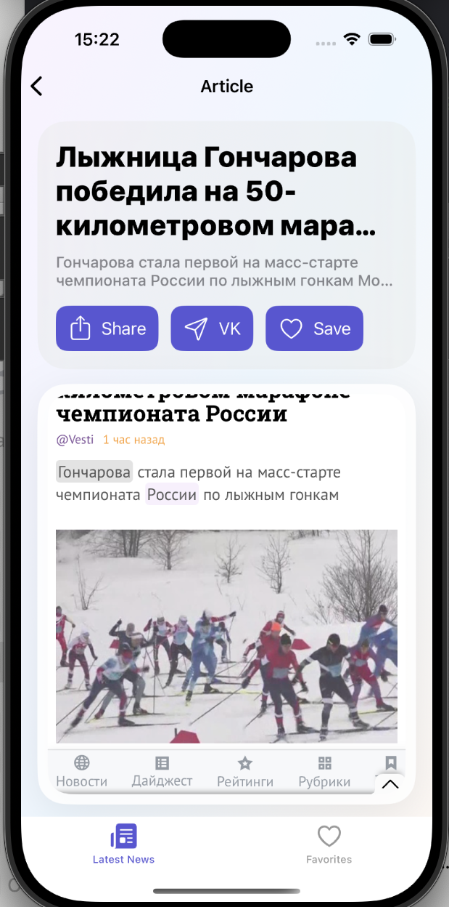
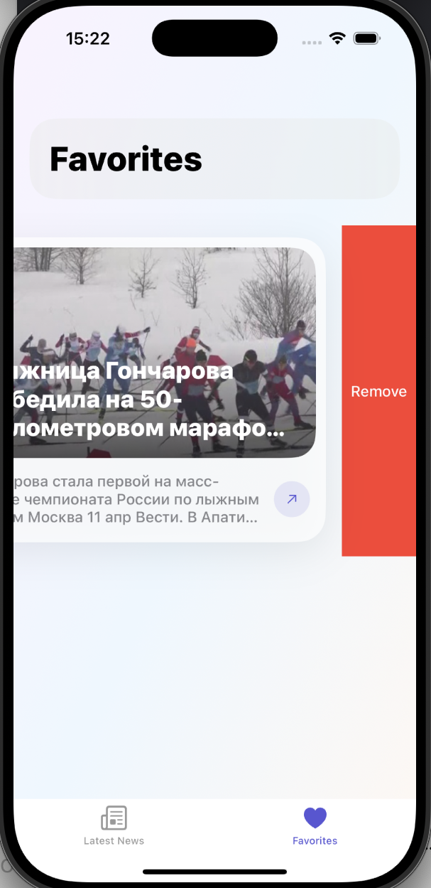

## О проекте

**News App iOS** — это приложение на **Swift + UIKit**, которое получает список новостей из внешнего API, отображает их в виде карточек, открывает полную статью на отдельном экране и позволяет сохранять понравившиеся материалы в избранное.

Проект показывает навыки:
- работы с сетевыми запросами;
- загрузки и отображения данных из REST API;
- использования Async/Await и `URLSession`;
- хранения данных через `UserDefaults`;
- построения UI на UIKit без storyboard;
- разделения кода по слоям и ответственности;
- реализации кэширования изображений и infinite scroll.

---

## Скриншоты

### Лента новостей

### Экран статьи

### Избранное

---

## Основные возможности

### Лента новостей
- загрузка новостей из внешнего API;
- отображение статей в виде кастомных карточек;
- pull-to-refresh;
- постраничная подгрузка новостей (infinite scroll);
- обработка ошибок загрузки.

### Экран статьи
- открытие полной статьи внутри приложения;
- отображение заголовка и описания;
- загрузка контента через `WKWebView`;
- индикатор загрузки и fallback при ошибке;
- кнопки:
  - **Share**
  - **VK**
  - **Save / Saved**

### Избранное
- сохранение статьи в избранное;
- удаление статьи из избранного;
- хранение списка через `UserDefaults`;
- отображение пустого состояния, если сохранённых статей нет.

### Работа с изображениями
- асинхронная загрузка картинок;
- кэширование через `NSCache`;
- shimmer-placeholder во время загрузки;
- плавный transition при появлении изображения.

---

## 🛠️ Стек

- **Swift**
- **UIKit**
- **URLSession**
- **Async/Await**
- **WKWebView**
- **UserDefaults**
- **Codable**
- **NSCache**
- **UITableView**
- **UITabBarController**
- **UINavigationController**
- **Auto Layout**
- кастомные UI-компоненты

---

## Архитектура

Проект организован по модульному принципу с разделением ответственности между слоями.

### News-модуль
- **View** — `NewsViewController`
- **Interactor** — `NewsInteractor`
- **Presenter** — `NewsPresenter`
- **Router** — `NewsRouter`
- **Assembly** — `NewsAssembly`

Такой подход позволяет:
- отделить UI от бизнес-логики;
- не смешивать сетевой слой с контроллером;
- централизовать навигацию;
- упростить поддержку и масштабирование проекта.
- 
По структуре проект близок к VIPER подходу

---
